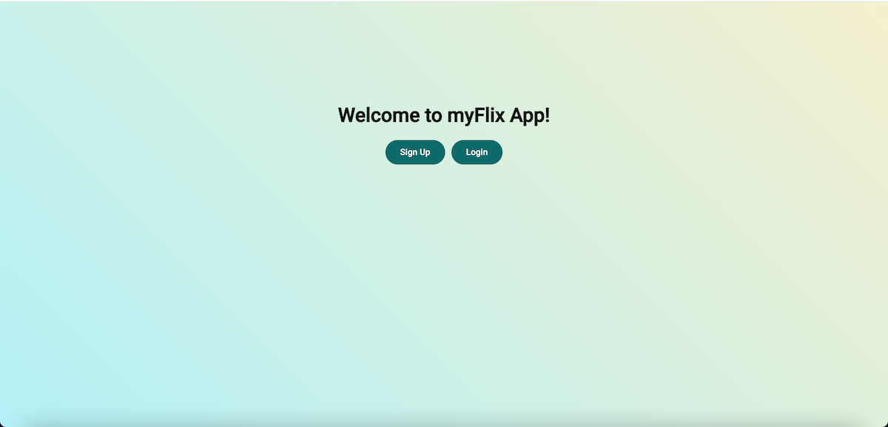
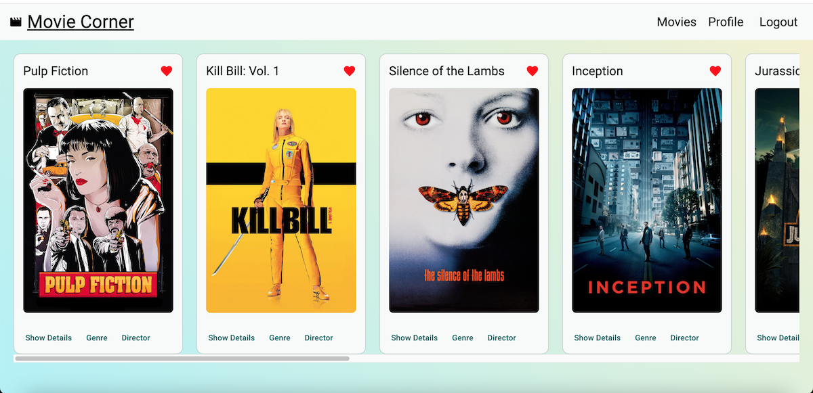
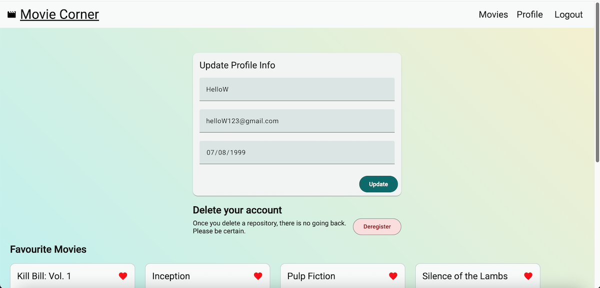

# MyFlix-Angular-Client

This is a client-side application for the [movie_api](https://github.com/deeps4/movie_api), which provides a collection of movies. Users can register, log in, and add movies to their list of favorites. The application is built using Angular.

---

## Table of Contents

1. [Key Features](#key-features)
2. [Technical Requirements](#technical-requirements)
3. [Technologies Used](#technologies-used)
4. [Installation](#installation)
5. [Running the Application](#running-the-application)
6. [Documentation](#documentation)
7. [Deployment](#deployment)
8. [Screenshots](#screenshots)
9. [Contributing](#contributing)
10. [Contact](#contact)

---

## Key Features

- **Welcome View**: Users can log in or register.
- **Movie Dashboard**: Authenticated users can view a list of movies.
- **Single Movie View**:
  - A button to display movie summary.
  - A button to view director information.
  - A button to view genre details.
- **User Profile**:
  - Update user information.
  - Deregister account.
- **Favorite Movies**:
  - Add or remove movies from favorites.
  - Filter movies to show only favorites.

---

## Technical Requirements

- **Node.js** version 20 (or later)
- **npm** version 10 (or later)
- **Angular** version 19
- **Angular Material** for UI design

---

## Technologies Used

- **Angular**
- **TypeScript**
- **Node.js**
- **npm**
- **Angular Material**
- **Typedoc** & **JSDoc** (for documentation)
- **GitHub Pages** (for deployment)

---

## Installation

Follow these steps to set up the project locally:

1. **Clone the Repository**

   ```bash
   git clone git@github.com:deeps4/myFlix-Angular-client.git
   cd myFlix-Angular-client
   ```

2. **Install Dependencies**
   Ensure you have Node.js (v20 or higher) and npm (v10 or higher) installed.

   ```bash
   npm install
   ```

3. **Angular CLI**
   If you haven't installed Angular CLI:

   ```bash
   npm install -g @angular/cli
   ```

4. **Add angular-cli-ghpages**
   ```
   ng add angular-cli-ghpages
   ```

---

## Running the Application

Start the development server:

```bash
npm start
```

The app will be available at: **`http://localhost:8080`**

---

## Documentation

- **TypeDoc** and **JSDoc** are used for code documentation.
- To generate the documentation:
  ```bash
  npx typedoc --out docs src/
  ```
  Open the `docs` folder to view the generated API documentation.

> **_NOTE:_** Document for this application is enhanced using AI.

---

## Deployment

The project is deployed using GitHub Pages.

1. **Build the Project**
   ```bash
   npm run build --configuration production
   ```
2. **Deploy**
   Use Angular CLI's deployment command:
   ```bash
   ng deploy --base-href=/myFlix-Angular-client/
   ```
   The app will be live at: **`https://deeps4.github.io/myFlix-Angular-client`**

---

## Screenshots

### 1. Welcome Page



### 2. Movies Dashboard



### 3. User Profile



---

## Contributing

Contributions are welcome! To contribute:

1. Fork the repository.
2. Create a new branch for your feature.
3. Commit your changes and submit a pull request.

---

## Contact

For questions, reach out to:

- **Name**: Deepa Sharma
- **Email**: deepasharma04@yahoo.com
- **GitHub**: [https://github.com/deeps4](https://github.com/deeps4)

---

**Enjoy exploring MyFlix-Angular-Client! 🎬**
